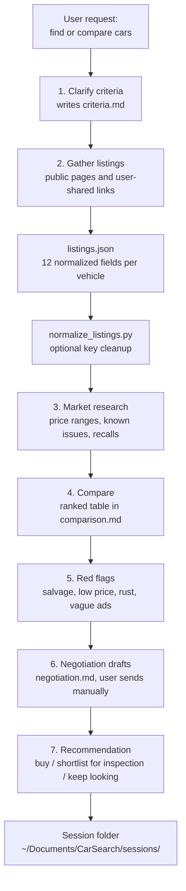

# Car Buying Assistant

An agent skill that runs a structured car-buying workflow for the Canadian market: clarify criteria, gather public listings, research fair value, flag risks, draft negotiation emails, and make a clear buy-or-pass call.

## What it does

- Interviews the buyer and records criteria (budget, use case, location, powertrain, deal-breakers) in a per-search `criteria.md`
- Extracts candidate listings from public sources (AutoTrader.ca, Kijiji Autos, CarGurus.ca, dealer sites) into a normalized `listings.json` with 12 defined fields per vehicle
- Researches fair market value and model-specific issues (recalls, rust-prone years, known failures) using Reddit, forums, and Canadian Black Book
- Produces a ranked comparison with a value call per vehicle (good deal / fair / overpriced) plus a stated confidence level
- Flags red flags explicitly: salvage or rebuilt titles, prices far below market, high mileage, vague descriptions, long time on market
- Drafts inquiry and negotiation emails for the top candidates; the buyer reviews and sends them manually

## Why it exists

Buying a used car means juggling half a dozen listing sites, unreliable seller claims, and price anchoring from dealers. Most people do this research in browser tabs and lose it. This skill turns the process into a repeatable workflow with a persistent paper trail: every search gets its own session folder under `~/Documents/CarSearch/` with criteria, normalized data, comparison, and negotiation drafts. It is built for the Ontario market and nearby regions, where provincial rebates and rust history matter.

## Architecture

The skill is a prompt-driven workflow (SKILL.md plus an agent definition) with one Python helper. There is no browser automation. The seven stages below are the workflow as written in `SKILL.md`.



## Quick start

The skill is designed for an OpenClaw-compatible agent runtime. Install it into the skills directory and let the agent pick it up:

```bash
# Place the skill where the agent loads skills from
cp -r car-buying-assistant ~/.openclaw/skills/car-buying-assistant
```

Then ask the agent, for example:

> "Help me find a used Xterra under $7k in Vancouver"

The helper script runs standalone:

```bash
cd ~/.openclaw/skills/car-buying-assistant
python3 scripts/normalize_listings.py \
  --input ~/Documents/CarSearch/sessions/2026-03-16-example-search/listings.json \
  --output ~/Documents/CarSearch/sessions/2026-03-16-example-search/listings.normalized.json
```

`normalize_listings.py` has no dependencies beyond the Python 3 standard library. It enforces the 12 expected keys, fills missing values with null, and passes unknown keys through.

## Design decisions

- **Hard safety boundaries over capability.** The skill never logs in, never sends money, never submits credit applications, and never sends a message itself. Every email is a draft the buyer sends manually. These rules are written as non-negotiable constraints at the top of both SKILL.md and the agent definition.
- **Files as the interface.** Each search is a dated session folder with five markdown/JSON files. This makes the research auditable and resumable across sessions instead of living only in chat history.
- **Skepticism is built into the output format.** Every assessment carries a confidence level, scraped data is treated as approximate by rule, and the workflow always recommends a pre-purchase inspection and a vehicle history report before any buy call.
- **`agent/models.json` ships provider configs for local Ollama models plus xAI and OpenAI placeholders.** The skill text does not reference it yet; it is scaffolding for a scripted execution mode.

## Status

Experimental. Version 0.1.0. The workflow and helper script are complete and self-consistent, but this is a personal single-user skill with no tests and no packaging beyond copy-in installation.
